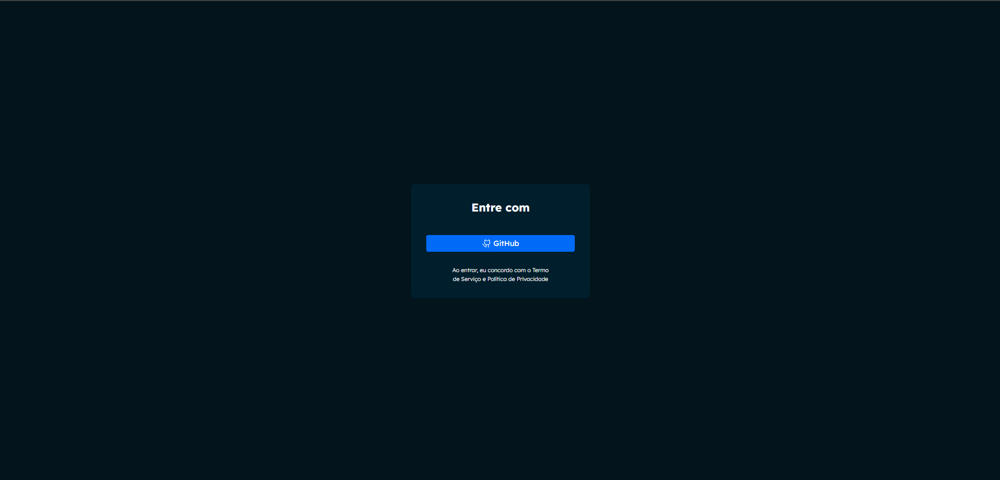
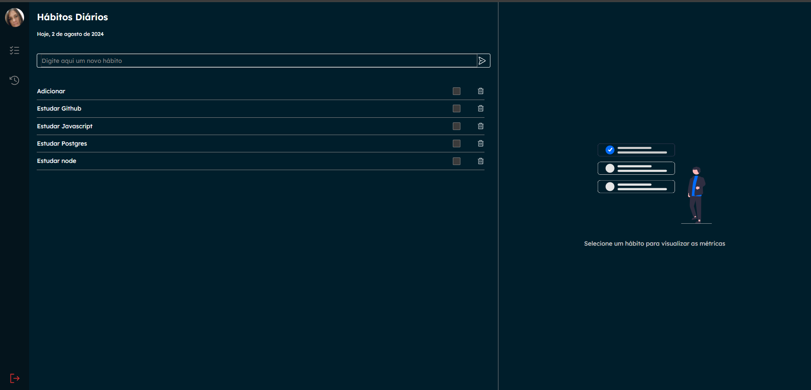
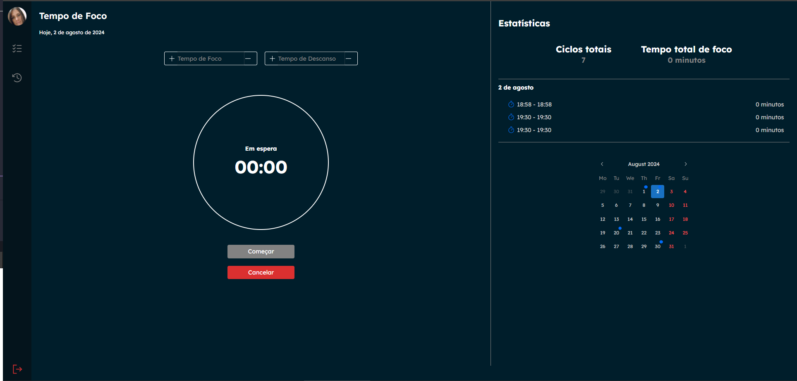

# Projeto Controle Hábitos

O projeto foi pensado para organizar os hábitos parecido com uma agenda, é possivel adicionar hábitos, tempo de foco, tempo de descanso, ter as métricas por data e por tempo, e login com github.

## Tecnologias e Bibliotecas Utilizadas

### Principais Tecnologias
- **React:** Biblioteca JavaScript para criação da interface de usuário.
- **Vite:** Ferramenta de build para projetos frontend, otimizada para velocidade.
- **TypeScript:** Superset do JavaScript que adiciona tipos estáticos, auxiliando no desenvolvimento mais seguro e eficiente.
- **Eslint + Prettier:** Ferramentas para manter a consistência e qualidade do código.

### Estilização
- **CSS Modules:** Permite escopo local para os estilos CSS, prevenindo conflitos de nomes.
- **@mantine/core:** Conjunto de componentes UI para React, com suporte a tema e acessibilidade.
- **@mantine/dates:** Componentes de data e hora do Mantine.
- **@mantine/hooks:** Hooks úteis fornecidos pelo Mantine para facilitar o desenvolvimento.

### Funcionalidades Adicionais
- **React Router:** Biblioteca para roteamento de páginas em aplicações React.
- **Axios:** Biblioteca para fazer requisições HTTP, facilitando a integração com APIs backend.
- **dayjs:** Biblioteca para manipulação e formatação de datas.
- **react-timer-hook:** Hooks para trabalhar com timers e cronômetros em React.
- **localforage:** Biblioteca para armazenamento local assíncrono, com suporte a IndexedDB, WebSQL e localStorage.
- **match-sorter:** Utilitário para classificação e correspondência de dados, útil em funcionalidades de busca.
- **sort-by:** Função utilitária para ordenar listas de objetos.

### Ícones e Utilitários
- **@phosphor-icons/react:** Biblioteca de ícones para React, permitindo fácil integração de ícones no projeto.
- **clsx:** Utilitário para condicionalmente juntar classes CSS.

### Dependências do React
- **react-dom:** Pacote principal para manipulação do DOM com React.
- **react-router-dom:** Implementação do React Router para aplicações web.

### Fotos de Telas

